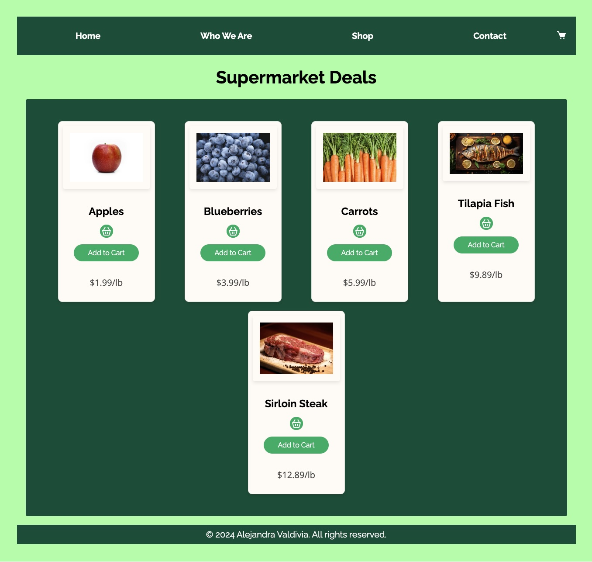

# React + Vite Supermarket Deals App

This is a [React + Vite](https://vitejs.dev/guide/) project.

## Install

git clone https://github.com/AlejandraValdivia/super-market-react.git

cd super-market-react

## Install dependencies

To install dependencies, run

```bash
npm i
```

## Run

```bash
npm run dev
```

## Render

Go to http://localhost:5175/ and open http://localhost:5175/ in your browser

## Author

Alejandra Valdivia

## Screenshot


